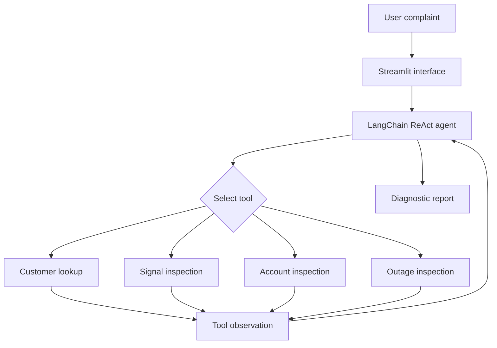

# agentic-ai-isp-portfolio
# Project 1 - SFN Intelligent Troubleshooting Agent

An Agentic AI application that receives an ISP customer complaint, breaks
the problem into diagnostic tasks, selects appropriate tools and produces
an evidence-based troubleshooting report.

## Problem

ISP operators often need to manually check customer records, optical
signal, account status and area outages before diagnosing a complaint.
This process takes time and can produce inconsistent results.

This project automates the initial diagnostic process using a ReAct-style
AI agent.

## Main Concepts

- ReAct agent workflow
- LangChain
- Groq LLM
- Local tool calling
- Pydantic input validation
- Streamlit interface
- Automated testing

## Architecture



## Agent Workflow

1. The user enters a connection ID and complaint.
2. Pydantic validates the input.
3. The agent analyzes the troubleshooting goal.
4. The agent selects and calls the required tools.
5. Tool results are returned as observations.
6. The agent continues until enough evidence is available.
7. A final diagnostic report and recommended actions are produced.

## Available Tools

| Tool | Purpose |
|---|---|
| `find_customer` | Retrieves the customer record |
| `inspect_optical_signal` | Classifies the RX power condition |
| `inspect_account_status` | Checks account, payment and router status |
| `inspect_area_outage` | Checks for an active area outage |

## Signal Classification

| RX power | Condition |
|---|---|
| -23 dBm or higher | Good |
| Between -23 and -27 dBm | Weak |
| Below -27 dBm | Critical |

These thresholds are demonstration rules used for this project.

## Dataset

The application uses two original fictional datasets:

- `customers.csv`
- `outages.csv`

No real customer names, phone numbers, CNIC information or private ISP
credentials are included.

## Technology Stack

- Python 3.12
- LangChain
- LangChain Groq integration
- Groq `openai/gpt-oss-20b`
- Streamlit
- Pydantic
- Python `unittest`
- python-dotenv

## Project Structure

```text
project-01-task-agent/
├── data/
│   ├── customers.csv
│   └── outages.csv
├── screenshots/
│   ├── app-interface.png
│   └── diagnostic-report.png
├── tests/
│   └── test_tools.py
├── .env.example
├── agent.py
├── app.py
├── models.py
├── README.md
├── requirements.txt
└── tools.py
```

## Installation

Clone the repository and enter the Project 1 directory:

```bash
git clone https://github.com/mohsahil0010-dev/agentic-ai-isp-portfolio.git
cd agentic-ai-isp-portfolio/project-01-task-agent
```

Install the required packages:

```bash
py -3.12 -m pip install -r requirements.txt
```

Create a `.env` file using `.env.example` and add a Groq API key:

```env
GROQ_API_KEY=your_actual_api_key
```

Never upload the real `.env` file to GitHub.

## Run the Application

```bash
py -3.12 -m streamlit run app.py
```

Open:

```text
http://localhost:8501
```

## Run Automated Tests

```bash
py -3.12 -m unittest discover -s tests -v
```

The project includes tests for:

- Existing customer lookup
- Unknown customer handling
- Good optical signal
- Weak optical signal
- Critical optical signal
- Active area outage
- Resolved area outage
- Disabled customer account

## Example

Input:

```text
Customer ID: 80105
Complaint: Customer has no internet and a red LOS light.
```

The agent checks the customer, optical signal, account information and area
outage before returning the probable cause, evidence, recommended actions
and urgency.

## Screenshots

### Application Interface


### Diagnostic Report


## Safety and Guardrails

- API keys are loaded from environment variables.
- `.env` is excluded from Git.
- Inputs are validated using Pydantic.
- Tool results are based only on local demonstration data.
- The agent is instructed not to invent unavailable information.
- Provider and network errors are handled in the Streamlit interface.

## Originality

This project uses an original ISP troubleshooting workflow based on
practical fiber-network operations. All customer and outage records are
fictional and were created specifically for this course project.