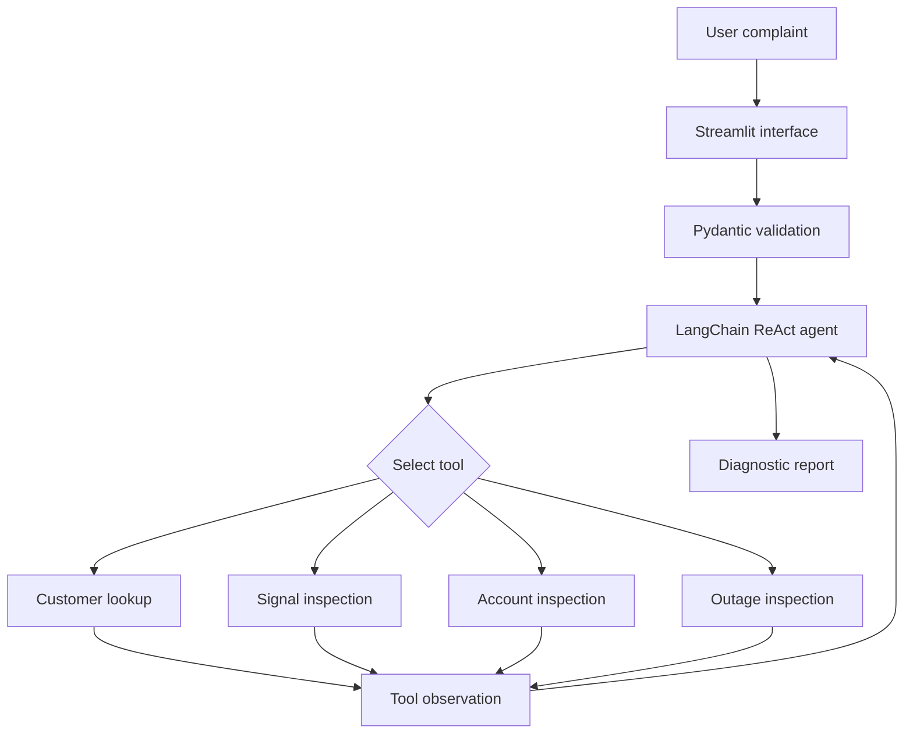
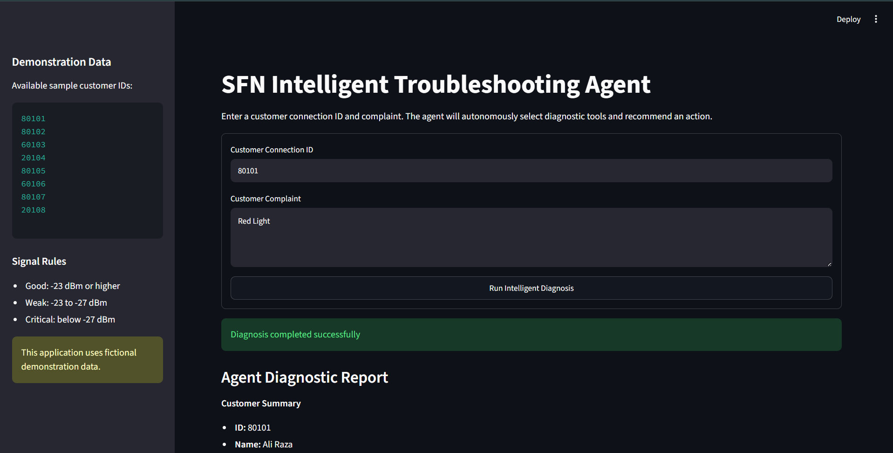
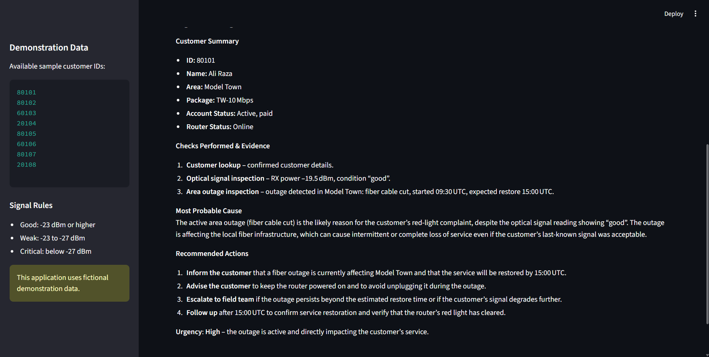

# Project 1 - SFN Intelligent Troubleshooting Agent

An Agentic AI application that receives an ISP customer complaint, breaks the problem into diagnostic tasks, selects appropriate tools and produces an evidence-based troubleshooting report.

## Live Demo

[Open the deployed SFN Intelligent Troubleshooting Agent](https://sfn-ai-troubleshooting.streamlit.app)

## Problem

ISP operators often need to manually check customer records, optical signal, account status and area outages before diagnosing a complaint.

This process takes time and can produce inconsistent results. The SFN Intelligent Troubleshooting Agent automates the initial diagnostic process using a ReAct-style AI workflow.

## Objectives

The project is designed to:

* Receive an ISP customer complaint
* Validate the customer ID and complaint
* Break the complaint into diagnostic tasks
* Select the appropriate diagnostic tools
* Collect evidence from local data
* Identify the most probable cause
* Recommend suitable actions
* Assign an urgency level

## Main Concepts

* ReAct agent workflow
* LangChain
* Groq LLM
* Local tool calling
* Pydantic input validation
* Streamlit interface
* Automated testing
* Environment-variable security

## Architecture



## ReAct Workflow

The project follows a reasoning-and-action workflow:

1. The user provides a customer connection ID and complaint.
2. Pydantic validates the input.
3. The agent analyzes the troubleshooting goal.
4. The agent selects an appropriate tool.
5. The selected tool retrieves diagnostic evidence.
6. The agent observes the returned result.
7. The agent selects more tools when additional evidence is required.
8. The agent produces a final evidence-based report.

The final response includes:

* Customer summary
* Checks performed
* Diagnostic evidence
* Most probable cause
* Recommended actions
* Urgency level

## Available Tools

| Tool                     | Purpose                                             |
| ------------------------ | --------------------------------------------------- |
| `find_customer`          | Retrieves a customer record using the connection ID |
| `inspect_optical_signal` | Checks RX power and classifies signal condition     |
| `inspect_account_status` | Checks account, payment, package and router status  |
| `inspect_area_outage`    | Checks whether an area has an active outage         |

## Signal Classification

| RX power                | Condition |
| ----------------------- | --------- |
| -23 dBm or higher       | Good      |
| Between -23 and -27 dBm | Weak      |
| Below -27 dBm           | Critical  |

These signal thresholds are documented demonstration rules for this project.

## Dataset

The application uses two original fictional datasets.

### Customer Dataset

`data/customers.csv` contains:

* Customer ID
* Customer name
* Area
* Package
* Account status
* RX power
* Payment status
* Router status

### Outage Dataset

`data/outages.csv` contains:

* Outage ID
* Area
* Status
* Issue
* Starting time
* Estimated restoration time

No real customer names, phone numbers, CNIC information or private ISP credentials are included.

## Technology Stack

* Python 3.12
* LangChain
* LangChain Groq integration
* Groq `openai/gpt-oss-20b`
* Streamlit
* Pydantic
* python-dotenv
* Python `unittest`
* Git and GitHub
* Streamlit Community Cloud

## Project Structure

```text
project-01-task-agent/
├── data/
│   ├── customers.csv
│   └── outages.csv
├── screenshots/
│   ├── app-interface.png
│   └── diagnostic-report.png
├── tests/
│   └── test_tools.py
├── .env.example
├── agent.py
├── app.py
├── models.py
├── README.md
├── requirements.txt
└── tools.py
```

## Installation

Clone the repository:

```bash
git clone https://github.com/mohsahil0010-dev/agentic-ai-isp-portfolio.git
```

Enter the Project 1 directory:

```bash
cd agentic-ai-isp-portfolio/project-01-task-agent
```

Install the required Python packages:

```bash
py -3.12 -m pip install -r requirements.txt
```

## API Configuration

Create a local `.env` file inside the Project 1 directory:

```env
GROQ_API_KEY=your_actual_groq_api_key
```

The real `.env` file must never be uploaded to GitHub.

The safe `.env.example` file contains only:

```env
GROQ_API_KEY=your_groq_api_key_here
```

For Streamlit Community Cloud, add the key through the application’s Secrets settings:

```toml
GROQ_API_KEY = "your_actual_groq_api_key"
```

## Run the Application

From the Project 1 folder, run:

```bash
py -3.12 -m streamlit run app.py
```

Open the local application at:

```text
http://localhost:8501
```

## Run Automated Tests

From the Project 1 directory, run:

```bash
py -3.12 -m unittest discover -s tests -v
```

The automated tests verify:

* Existing customer lookup
* Unknown customer handling
* Good optical signal
* Weak optical signal
* Critical optical signal
* Active area outage
* Resolved area outage
* Disabled customer account

Expected result:

```text
Ran 8 tests
OK
```

## Example Input

```text
Customer ID: 80105
Complaint: Customer has no internet and a red LOS light.
```

The agent retrieves the customer record, inspects the optical signal, checks account information and searches for an active area outage.

It then produces a report containing the evidence, probable cause, recommended actions and urgency.

## Screenshots

### Application Interface



### Diagnostic Report



## Error Handling

The project handles:

* Empty customer IDs
* Invalid customer ID formats
* Short or empty complaints
* Unknown customer IDs
* Invalid signal values
* Missing data files
* Missing API keys
* Provider and network errors

## Safety and Guardrails

* The Groq API key is loaded from an environment variable.
* The real `.env` file is excluded from Git.
* Inputs are validated using Pydantic.
* Diagnostic results are based only on local fictional data.
* The agent is instructed not to invent missing information.
* Errors are shown without exposing the API key.
* No real customer data is included.

## Originality

This project uses an original ISP troubleshooting workflow based on practical fiber-network operations.

The dataset, tool functions, agent instructions, validation workflow and interface were created specifically for this Agentic AI course project.

## Author

M Sahil

Agentic AI Course Portfolio
University of Layyah Short Course Program
