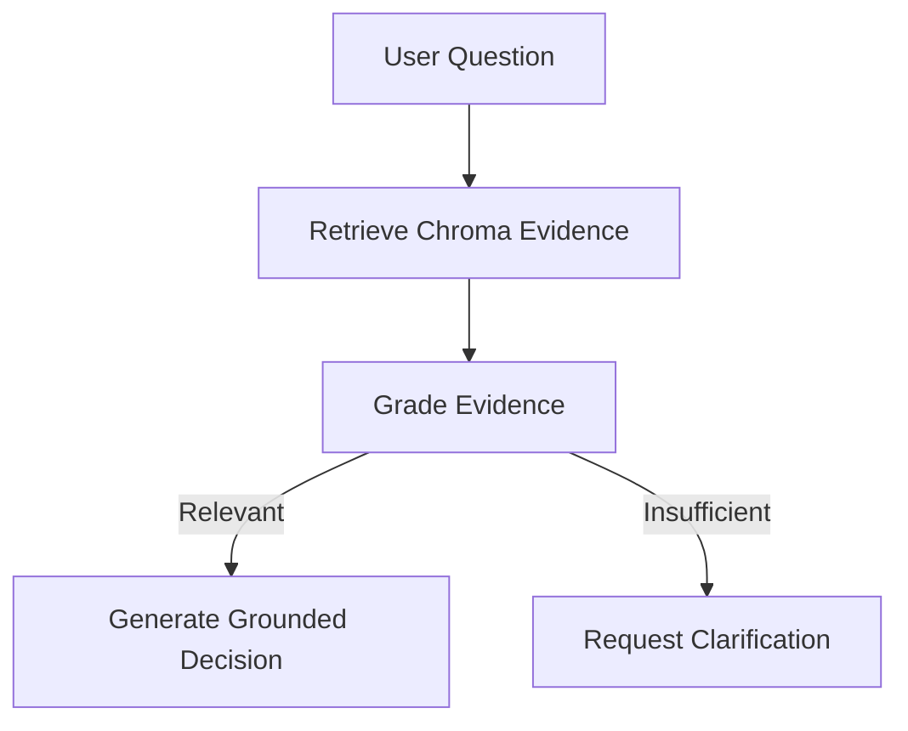
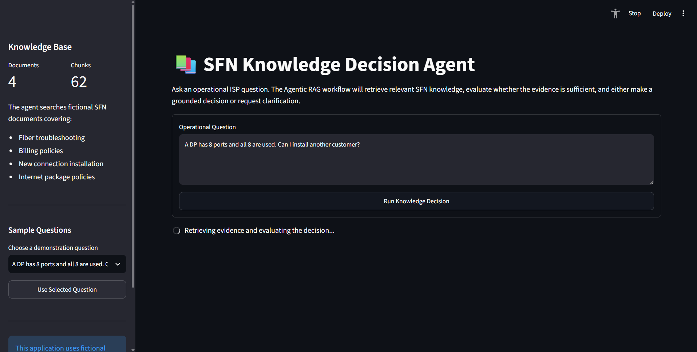
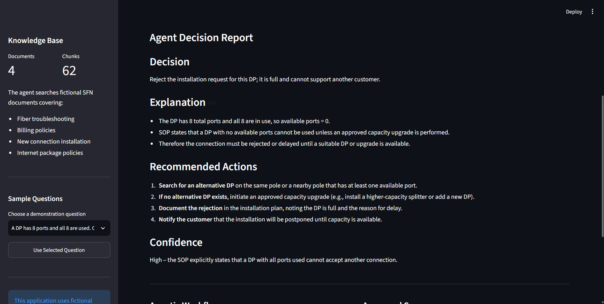
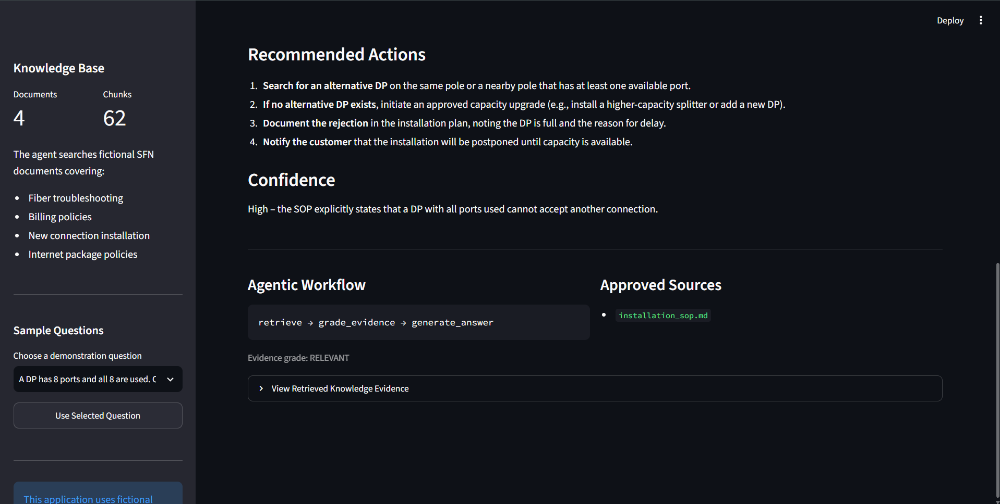

# Project 2 — SFN Knowledge Decision Agent

An Agentic Retrieval-Augmented Generation application that searches a fictional ISP knowledge base, evaluates the retrieved evidence and produces grounded operational decisions.

This project was developed as Project 2 of the Agentic AI course portfolio.

## Live Demo

The public Streamlit deployment link will be added here after deployment.

## Project Overview

Internet service providers maintain operational knowledge across troubleshooting guides, billing policies, package rules and installation procedures. Staff members may need to search several documents before making a decision.

The SFN Knowledge Decision Agent provides a single interface where a user can ask an operational ISP question in natural language.

The application:

1. Searches a Chroma vector database.
2. Retrieves the most relevant knowledge chunks.
3. Uses an LLM to evaluate whether the evidence is sufficient.
4. Routes the request through a LangGraph workflow.
5. Produces a grounded decision or requests clarification.
6. Displays the sources and evidence used.

All SFN documents and examples in this project are fictional and were created specifically for academic demonstration.

## Problem Statement

Traditional document search normally returns files or keyword matches but does not determine whether the retrieved material is sufficient for a reliable operational decision.

An ordinary chatbot may also answer using unsupported assumptions.

This project solves that problem using Agentic RAG. The agent does not immediately generate an answer. It first retrieves evidence and then evaluates whether that evidence is relevant.

If the knowledge is sufficient, it generates a grounded decision. If the knowledge is insufficient, it refuses to invent an answer and requests clarification.

## Main Objectives

- Build an Agentic RAG workflow.
- Store fictional ISP knowledge in Chroma.
- Retrieve relevant document chunks using vector similarity.
- Grade the retrieved evidence before answering.
- Generate decisions using only approved knowledge.
- Route insufficient-evidence questions to a clarification response.
- Display workflow steps, sources and retrieved evidence.
- Provide a functional Streamlit interface.
- Protect API keys and generated database files.
- Include automated retrieval tests.

## Key Features

- Semantic search over ISP operational documents
- Persistent Chroma vector database
- Local `all-MiniLM-L6-v2` embeddings through Chroma
- Markdown document ingestion
- Recursive text splitting with overlapping chunks
- LangGraph state-based workflow
- LLM-powered evidence grading
- Conditional answer and clarification branches
- Grounded decision generation
- Source-document reporting
- Retrieved-evidence inspection
- Sample demonstration questions
- Automatic database creation when missing
- Streamlit secret support for public deployment
- Input validation and error handling
- Seven automated unit tests

## Agentic Workflow



The workflow contains four operational nodes:

1. `retrieve` searches the Chroma knowledge collection.
2. `grade_evidence` asks the LLM whether the retrieved information is sufficient.
3. `generate_answer` creates an evidence-based operational decision.
4. `request_clarification` safely refuses unsupported questions.

Example successful path:

```text
retrieve → grade_evidence → generate_answer
```

Example insufficient-evidence path:

```text
retrieve → grade_evidence → request_clarification
```

## Knowledge Base

The project contains four fictional Markdown documents.

| Document | Purpose |
|---|---|
| `fiber_troubleshooting.md` | Fiber, ONU, LOS, optical-signal and router troubleshooting |
| `billing_policy.md` | Payments, due balances, discounts, account status and billing rules |
| `installation_sop.md` | Surveys, poles, DPs, ports, fiber distance, ONU installation and handover |
| `package_policy.md` | Package selection, upgrades, downgrades and speed-related decisions |

The ingestion process currently creates:

- 4 source documents
- 62 overlapping knowledge chunks
- 1 persistent Chroma collection named `sfn_knowledge`

## Technology Stack

| Technology | Usage |
|---|---|
| Python 3.12 | Main programming language |
| Streamlit | Interactive web interface |
| LangChain | Messages and text-processing components |
| LangGraph | Agentic state and conditional workflow |
| ChromaDB | Persistent vector database |
| Chroma default embeddings | Local document and query embeddings |
| Groq | Language-model API |
| Pydantic | Structured application models |
| python-dotenv | Local environment-variable loading |
| unittest | Automated testing |

## Project Structure

```text
project-02-knowledge-agent/
│
├── app.py
├── graph.py
├── ingest.py
├── models.py
├── retriever.py
├── requirements.txt
├── README.md
├── .env.example
│
├── data/
│   ├── billing_policy.md
│   ├── fiber_troubleshooting.md
│   ├── installation_sop.md
│   └── package_policy.md
│
├── screenshots/
│   ├── agentic-workflow-sources.png
│   ├── grounded-decision-report.png
│   └── knowledge-agent-interface.png
│
└── tests/
    └── test_retriever.py
```

The generated `chroma_db` directory and private `.env` file are intentionally excluded from Git.

## Application Components

### `ingest.py`

The ingestion module:

- Loads every Markdown file from `data`
- Ignores empty documents
- Splits documents into overlapping chunks
- Adds source and chunk-number metadata
- Creates the persistent Chroma database
- Rebuilds the collection without duplicate records

### `retriever.py`

The retrieval module:

- Opens the `sfn_knowledge` collection
- Validates the user question
- Performs vector similarity search
- Returns structured retrieved chunks
- Preserves source, chunk number and vector distance
- Formats evidence for the language model

### `graph.py`

The graph module:

- Defines the shared LangGraph state
- Retrieves relevant evidence
- Grades evidence using the Groq model
- Routes requests using conditional edges
- Generates grounded Markdown decisions
- Returns a clarification response when evidence is insufficient
- Records the workflow path and approved sources

### `app.py`

The Streamlit application:

- Loads local or deployed secrets
- Builds the knowledge database when missing
- Displays document and chunk statistics
- Provides sample questions
- Runs the Agentic RAG workflow
- Displays decisions, confidence and recommended actions
- Shows the workflow path and approved sources
- Allows inspection of retrieved evidence

### `models.py`

The models module defines structured Pydantic objects for retrieved knowledge and final knowledge responses.

## Installation

### 1. Clone the repository

```bash
git clone https://github.com/mohsahil0010-dev/agentic-ai-isp-portfolio.git
cd agentic-ai-isp-portfolio/project-02-knowledge-agent
```

### 2. Use Python 3.12

Verify Python:

```bash
py -3.12 --version
```

### 3. Install dependencies

```bash
py -3.12 -m pip install -r requirements.txt
```

### 4. Configure the environment

Create a local `.env` file using `.env.example` as the template:

```text
GROQ_API_KEY=your_private_groq_api_key
GROQ_MODEL=openai/gpt-oss-20b
```

Never commit the real `.env` file or publish the API key.

## Build the Knowledge Base

Run:

```bash
py -3.12 ingest.py
```

Expected result:

```text
Knowledge base created successfully
Source documents: 4
Stored chunks: 62
Collection: sfn_knowledge
```

The command creates a local `chroma_db` directory.

The Streamlit application can also build the database automatically when it is missing.

## Run the Tests

```bash
py -3.12 -m unittest discover -s tests -v
```

Current result:

```text
Ran 7 tests

OK
```

The tests verify:

- The collection contains knowledge chunks
- DP-capacity questions retrieve the installation SOP
- LOS questions retrieve the troubleshooting document
- `top_k` limits the number of results
- Empty questions are rejected
- Invalid retrieval limits are rejected
- Formatted context contains source information

## Run the Streamlit Application

```bash
py -3.12 -m streamlit run app.py
```

Open the local URL displayed in the terminal, normally:

```text
http://localhost:8501
```

## Example Questions

### Installation decisions

```text
A DP has 8 ports and all 8 are used. Can I install another customer?
```

```text
The estimated fiber route is 150 meters. How much fiber is required?
```

```text
A newly installed ONU has an RX power of -29 dBm. Can we complete the installation?
```

### Troubleshooting decisions

```text
The customer's ONU has a red LOS light. What checks should be performed?
```

```text
The ONU signal is good but the router cannot connect. What should be checked?
```

### Billing decisions

```text
A customer paid the bill but the account is still disabled. What should support do?
```

### Package decisions

```text
Can a customer downgrade their package while an unpaid balance remains?
```

### Insufficient-evidence demonstration

```text
What is the annual leave policy for SFN employees?
```

The last question is intentionally outside the knowledge base. The expected workflow is:

```text
retrieve → grade_evidence → request_clarification
```

## Example Grounded Decision

Question:

```text
A DP has 8 ports and all 8 are used. Can I install another customer?
```

Expected decision:

- The DP is full.
- It cannot accept another connection.
- Another suitable DP should be selected.
- An approved capacity upgrade or new DP may be required.
- The installation should be delayed or rejected until capacity is available.

Approved source:

```text
installation_sop.md
```

## Screenshots

### Knowledge Agent Interface



### Grounded Decision Report



### Agentic Workflow and Sources



## Public Deployment

For Streamlit Community Cloud:

1. Push the project to the public GitHub repository.
2. Create a new Streamlit application.
3. Select the repository and `main` branch.
4. Set the application file to:

```text
project-02-knowledge-agent/app.py
```

5. Add the following private secret in Streamlit settings:

```toml
GROQ_API_KEY = "your_private_groq_api_key"
```

6. Deploy the application.
7. Test both the grounded-answer and clarification branches.
8. Add the public URL to this README.

The generated Chroma database is not required in GitHub because the application rebuilds it from the Markdown knowledge documents.

## Security and Privacy

- The real Groq API key is stored only in `.env` locally.
- Public deployment uses Streamlit Secrets.
- `.env` is excluded by `.gitignore`.
- `chroma_db` is excluded because it is generated automatically.
- The repository contains no real customer passwords.
- The knowledge documents use fictional academic data.
- Private ISP credentials must never be added to the repository.

## Limitations

- The agent can only make decisions using the included documents.
- Retrieval quality depends on document content and question wording.
- The first database build downloads the local embedding model.
- Groq access requires an internet connection and valid API key.
- The demonstration does not connect to a live billing system, OLT or MikroTik router.
- The application provides course-project decisions, not production authorization.

## Possible Future Improvements

- Add PDF and CSV document ingestion
- Add administrator document uploads
- Add conversation history
- Add query rewriting for weak retrieval
- Add human approval for high-impact decisions
- Add document version tracking
- Add retrieval evaluation datasets
- Add multilingual English and Urdu support
- Connect to approved live ISP systems
- Add role-based access control

## Learning Outcomes

This project demonstrates:

- Agentic Retrieval-Augmented Generation
- Vector-database creation
- Local embedding generation
- Semantic knowledge retrieval
- Evidence grading
- Conditional LangGraph routing
- Grounded LLM generation
- Safe refusal behavior
- Streamlit application development
- Secret management
- Automated testing
- Public deployment preparation

## Academic Integrity

This is an original academic implementation created for the Agentic AI course portfolio.

The domain, fictional documents, workflow, user interface and implementation were developed specifically for this project. No real customer information is included.

## Author

**M Sahil**

Agentic AI Course Portfolio  
Project 2 — Knowledge-Based Decision Agent