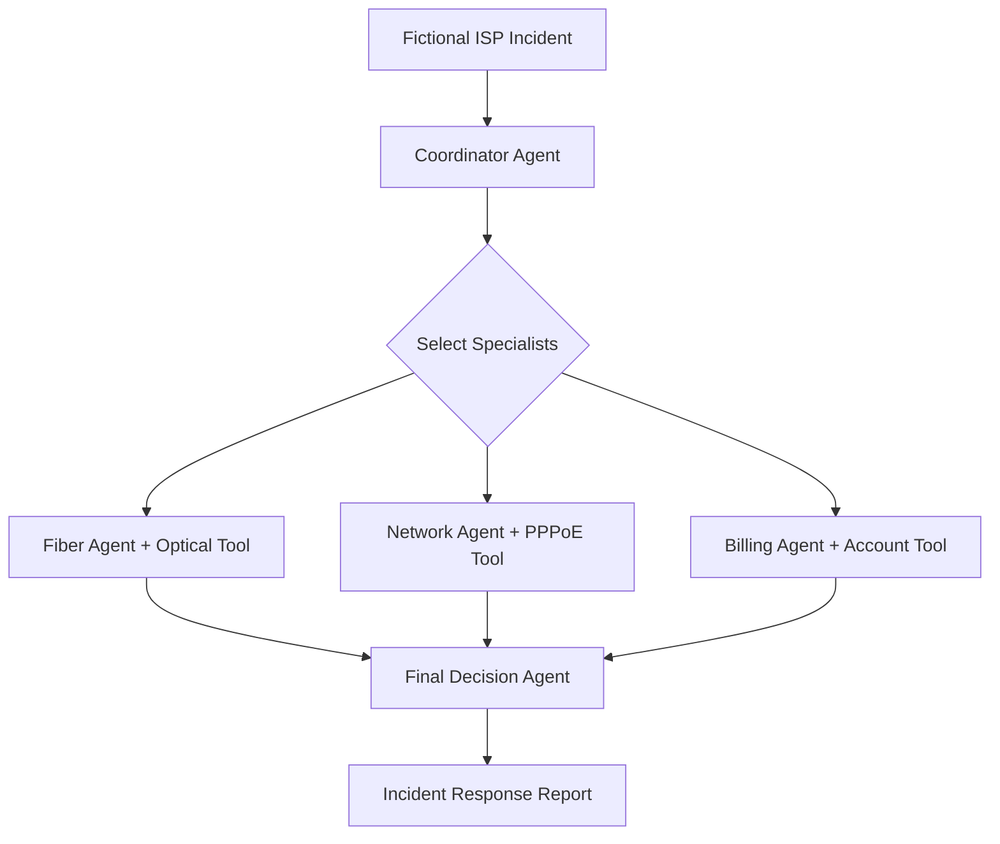
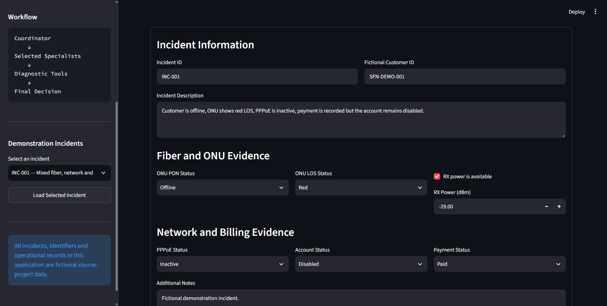
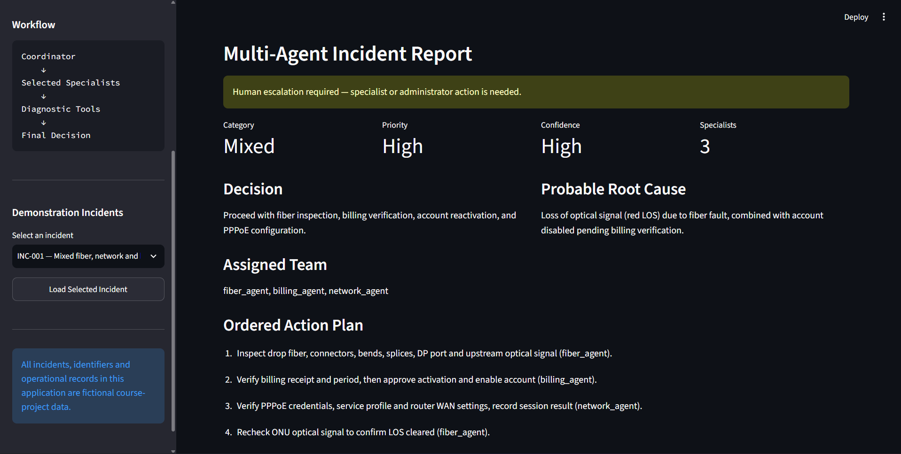
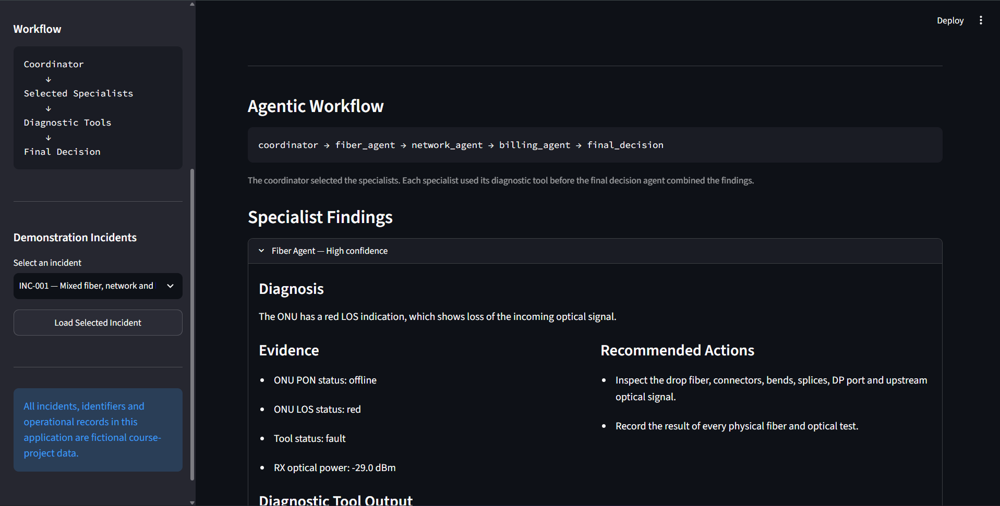

# Project 3 — SFN Multi-Agent Incident Response System

A LangGraph-based multi-agent application where specialized fictional ISP agents collaborate to diagnose fiber, network and billing incidents and produce one coordinated response plan.

This project was developed as Project 3 of the Agentic AI course portfolio.

## Live Demo

The public Streamlit deployment link will be added here after deployment.

## Project Overview

ISP incidents may involve several operational areas simultaneously. A customer can have a physical fiber fault, an inactive PPPoE session and a billing inconsistency at the same time.

Sending the complete incident to only one general chatbot may produce an incomplete or unsupported answer.

The SFN Multi-Agent Incident Response System solves this problem by dividing the investigation between specialized agents:

1. A coordinator analyzes the incident.
2. Relevant specialists are selected dynamically.
3. Each specialist calls a deterministic diagnostic tool.
4. Specialist findings are collected in shared LangGraph state.
5. A final decision agent combines the findings.
6. The application presents an ordered response plan and escalation decision.

All incidents, identifiers, network readings and operational records in this project are fictional course-project data.

## Problem Statement

Complex ISP incidents often cross technical and administrative boundaries.

For example:

* Red LOS requires fiber investigation.
* Inactive PPPoE requires network investigation.
* A paid-but-disabled account requires billing investigation.
* Restoring service may require coordination between all three teams.

A single-agent response may overlook one of these areas or recommend an action without sufficient evidence.

This project demonstrates a multi-agent workflow where each specialist remains within its defined scope and contributes structured evidence to a shared final decision.

## Main Objectives

* Build a multi-agent problem-solving system.
* Coordinate specialized agents using LangGraph.
* Dynamically route incidents to relevant specialists.
* Demonstrate LangChain tool calling.
* Create deterministic fiber, network and billing diagnostic tools.
* Preserve structured state across the workflow.
* Combine specialist findings into one final incident report.
* Add safe fallbacks for temporary LLM or network failures.
* Provide a professional Streamlit interface.
* Include fictional demonstration incidents.
* Include automated tests.
* Protect API keys and private information.

## Specialized Agents

### Coordinator Agent

The coordinator:

* Reads the complete incident.
* Identifies the relevant operational areas.
* Assigns one or more specialists.
* Selects the category and priority.
* Determines whether immediate human escalation is required.

The coordinator uses Groq structured output when available and has a deterministic fallback for API or connectivity failures.

### Fiber Agent

The fiber specialist analyzes:

* ONU PON status
* Red LOS indication
* RX optical power
* Drop fiber
* Connectors
* Bends
* Splices
* DP ports
* Splitters
* Upstream optical signal

It calls the `check_optical_signal` tool.

### Network Agent

The network specialist analyzes:

* PPPoE session status
* MikroTik service access
* Account authorization dependency
* PPPoE credentials
* Router WAN configuration
* Service profiles
* Router LAN, Wi-Fi and DNS checks

It calls the `check_pppoe_service` tool.

### Billing Agent

The billing specialist analyzes:

* Payment status
* Paid, unpaid and partial records
* Account enablement
* Paid-but-disabled inconsistencies
* Billing verification requirements
* Approved restoration dependencies

It calls the `check_billing_account` tool.

### Final Decision Agent

The final decision agent:

* Receives the coordinator triage.
* Reviews every specialist finding.
* Prioritizes direct diagnostic-tool evidence.
* Determines the probable root cause.
* Produces an ordered action plan.
* Identifies the responsible teams.
* Determines confidence and escalation.

It uses Groq JSON Schema output when available and a deterministic fallback if the external model service is temporarily unavailable.

## Multi-Agent Workflow



The coordinator can select one, two or all three specialists.

Example mixed-incident path:

```text
coordinator → fiber_agent → network_agent → billing_agent → final_decision
```

The specialist order may vary internally because LangGraph creates specialist tasks dynamically.

## Dynamic LangGraph Routing

The workflow uses LangGraph’s `Send` API.

After triage, the coordinator creates a specialist task for every assigned agent. Each task receives the same structured incident and coordinator decision.

Specialist findings are collected using an annotated list reducer:

```python
findings: Annotated[
    list[SpecialistFinding],
    operator.add,
]
```

After all assigned specialists complete their work, their findings are passed to the final decision node.

This is a map-reduce multi-agent workflow:

* Map: send the incident to selected specialists.
* Process: each specialist calls its diagnostic tool.
* Reduce: collect all findings.
* Synthesize: create one final report.

## Diagnostic Tools

### Optical Signal Tool

The optical tool classifies fictional ONU information:

| Condition                        | Result  |
| -------------------------------- | ------- |
| Red LOS                          | Fault   |
| ONU offline                      | Fault   |
| RX power of -23 dBm or higher    | Normal  |
| RX power between -23 and -27 dBm | Warning |
| RX power below -27 dBm           | Fault   |
| RX power missing                 | Unknown |

### PPPoE Service Tool

The PPPoE tool evaluates:

| Condition                                   | Result  |
| ------------------------------------------- | ------- |
| PPPoE active                                | Normal  |
| PPPoE inactive and account disabled         | Fault   |
| PPPoE inactive with no confirmed suspension | Fault   |
| PPPoE status unknown                        | Unknown |

### Billing Account Tool

The billing tool evaluates:

| Condition                | Result  |
| ------------------------ | ------- |
| Paid and enabled         | Normal  |
| Paid but disabled        | Fault   |
| Unpaid                   | Warning |
| Partial payment          | Warning |
| Insufficient information | Unknown |

These tools do not connect to a real MikroTik router, billing system, OLT or customer account.

## Reliability and Fallback Design

External model APIs can occasionally fail because of:

* Temporary service interruptions
* Network disconnections
* Rate limits
* Malformed structured output
* Provider capacity problems

The project remains usable during these failures.

The coordinator has a deterministic routing fallback, and the final decision agent has a deterministic synthesis fallback.

The specialist agents always use local deterministic diagnostic tools. Therefore, a temporary Groq failure does not prevent the incident workflow from producing a valid report.

This design demonstrates graceful degradation rather than exposing a complete application failure to the user.

## Key Features

* Multi-agent ISP incident investigation
* LangGraph shared state
* Dynamic specialist routing
* Map-reduce specialist workflow
* LangChain tool calling
* Fiber diagnostic specialist
* Network diagnostic specialist
* Billing diagnostic specialist
* Structured Pydantic models
* Groq JSON Schema responses
* Deterministic API-failure fallbacks
* Incident category and priority classification
* Probable root-cause analysis
* Ordered action planning
* Human escalation decisions
* Diagnostic evidence display
* Tool-output inspection
* Downloadable JSON reports
* Five demonstration incidents
* Ten automated tests
* Streamlit deployment support
* Secret management

## Technology Stack

| Technology     | Usage                                      |
| -------------- | ------------------------------------------ |
| Python 3.12    | Main programming language                  |
| Streamlit      | Interactive application interface          |
| LangGraph      | Multi-agent orchestration and shared state |
| LangChain Core | Messages and diagnostic tools              |
| LangChain Groq | Groq model integration                     |
| Groq           | Coordinator and final decision model API   |
| Pydantic       | Structured incidents, findings and reports |
| python-dotenv  | Local secret loading                       |
| JSON           | Demonstration incident storage             |
| unittest       | Automated testing                          |

## Project Structure

```text
project-03-multi-agent-system/
│
├── agents.py
├── app.py
├── graph.py
├── models.py
├── tools.py
├── requirements.txt
├── README.md
├── .env.example
│
├── data/
│   └── incident_cases.json
│
├── screenshots/
│   ├── multi-agent-final-report.png
│   ├── multi-agent-incident-form.png
│   └── multi-agent-workflow-specialists.png
│
└── tests/
    └── test_tools.py
```

The private `.env` file is excluded from Git.

## Application Components

### `models.py`

Defines structured Pydantic models for:

* Incident input
* Coordinator triage
* Tool observations
* Specialist findings
* Final incident reports

### `tools.py`

Contains three deterministic LangChain tools:

* `check_optical_signal`
* `check_pppoe_service`
* `check_billing_account`

The file also defines separate tool collections for fiber, network and billing specialists.

### `agents.py`

Contains:

* Groq model configuration
* Coordinator agent
* Deterministic coordinator fallback
* Fiber specialist
* Network specialist
* Billing specialist
* Specialist registry
* Final decision agent
* Deterministic final-decision fallback

### `graph.py`

Contains:

* Shared LangGraph state
* Coordinator node
* Dynamic specialist routing
* Specialist execution node
* Finding reducers
* Final decision node
* Compiled incident graph
* Public workflow execution function

### `app.py`

Provides:

* Demonstration incident selection
* Manual incident entry
* ONU, LOS and RX-power fields
* PPPoE, account and payment fields
* Multi-agent workflow execution
* Category, priority and confidence display
* Root-cause and decision display
* Ordered action plan
* Workflow-path display
* Specialist findings
* Diagnostic tool outputs
* JSON report download

### `data/incident_cases.json`

Contains five fictional demonstration incidents:

1. Mixed fiber, network and billing fault
2. Weak optical signal
3. Inactive PPPoE session
4. Paid customer account remains disabled
5. Healthy service verification

### `tests/test_tools.py`

Contains automated tests for:

* Red LOS classification
* Good optical signal
* Weak optical signal
* Critical optical signal
* Active PPPoE
* Inactive PPPoE with disabled account
* Paid and enabled account
* Paid but disabled account
* Mixed incident routing
* Fiber specialist tool evidence

## Installation

### 1. Clone the repository

```bash
git clone https://github.com/mohsahil0010-dev/agentic-ai-isp-portfolio.git
cd agentic-ai-isp-portfolio/project-03-multi-agent-system
```

### 2. Verify Python 3.12

```bash
py -3.12 --version
```

### 3. Install dependencies

```bash
py -3.12 -m pip install -r requirements.txt
```

### 4. Configure the environment

Create a private `.env` file:

```text
GROQ_API_KEY=your_private_groq_api_key
GROQ_MODEL=openai/gpt-oss-20b
```

Never commit the real `.env` file.

The public `.env.example` contains only placeholders:

```text
GROQ_API_KEY=replace_with_your_groq_api_key
GROQ_MODEL=openai/gpt-oss-20b
```

## Run the Application

From the Project 3 directory:

```bash
py -3.12 -m streamlit run app.py
```

Open the local address shown in the terminal, normally:

```text
http://localhost:8501
```

## Run the Tests

```bash
py -3.12 -m unittest discover -s tests -v
```

Current result:

```text
Ran 10 tests

OK
```

The tests do not contact Groq.

## Example Mixed Incident

```text
Customer is offline, ONU shows red LOS, PPPoE is inactive,
payment is recorded but the account remains disabled.
```

Structured evidence:

```text
ONU PON status: offline
ONU LOS status: red
RX power: -29 dBm
PPPoE status: inactive
Payment status: paid
Account status: disabled
```

Expected routing:

```text
coordinator
→ fiber_agent
→ network_agent
→ billing_agent
→ final_decision
```

Expected result:

* Category: Mixed
* Priority: High
* Confidence: High
* Fiber fault identified
* PPPoE fault identified
* Billing inconsistency identified
* Fiber, network and billing teams assigned
* Human escalation required

## Screenshots

### Incident Input Form



### Final Incident Report



### Workflow and Specialist Findings



## Public Deployment

For Streamlit Community Cloud:

1. Push Project 3 to the public GitHub repository.
2. Open Streamlit Community Cloud.
3. Create a new application.
4. Select the repository and `main` branch.
5. Set the application file to:

```text
project-03-multi-agent-system/app.py
```

6. Select Python 3.12.
7. Add the private Groq key through Streamlit Secrets:

```toml
GROQ_API_KEY = "your_private_groq_api_key"
```

8. Deploy the application.
9. Test the mixed incident.
10. Add the public URL to this README.

## Security and Privacy

* The real Groq API key is stored only in `.env` locally.
* `.env` is excluded from Git.
* Streamlit deployment uses encrypted secrets.
* `.env.example` contains placeholders only.
* Demonstration incidents use fictional customer IDs.
* No real passwords or account credentials are included.
* Diagnostic tools do not modify real systems.
* The application does not connect to a production MikroTik, OLT or billing system.
* Downloaded reports contain only the data submitted to the demonstration application.

## Safety Boundaries

The system:

* Does not perform real account activation.
* Does not make a financial transaction.
* Does not change MikroTik configuration.
* Does not register an ONU.
* Does not authorize unsafe pole or fiber work.
* Does not expose PPPoE passwords.
* Recommends human escalation for actions requiring physical or administrative access.

## Limitations

* The application uses fictional incident fields.
* Diagnostic tools use demonstration rules.
* It does not monitor a live network.
* It does not access a real customer database.
* LLM responses depend on Groq availability.
* Deterministic fallbacks may be less detailed than an LLM-generated response.
* Final operational actions require authorized human verification.

## Possible Future Improvements

* Connect to approved read-only MikroTik monitoring
* Add OLT and ONU status retrieval
* Add DP and pole inventory tools
* Add incident history
* Add technician assignment
* Add human approval checkpoints
* Add incident severity dashboards
* Add multilingual English and Urdu support
* Add PDF incident reports
* Add notification tools
* Add LangSmith tracing
* Add evaluation datasets
* Add role-based access control

## Learning Outcomes

This project demonstrates:

* Multi-agent system design
* Specialist role separation
* LangGraph state management
* Conditional and dynamic routing
* Map-reduce workflows
* LangChain tool calling
* Structured Pydantic output
* LLM-based coordination
* Evidence-backed decisions
* Graceful API-failure handling
* Streamlit application development
* Automated testing
* Secure secret management
* Public deployment preparation

## Academic Integrity

This is an original academic implementation created for the Agentic AI course portfolio.

The incidents, customer identifiers, diagnostic rules, workflow and user interface were created specifically for this fictional demonstration. No real customer information is included.

## Author

**M Sahil**

Agentic AI Course Portfolio
Project 3 — Multi-Agent Problem Solving System
