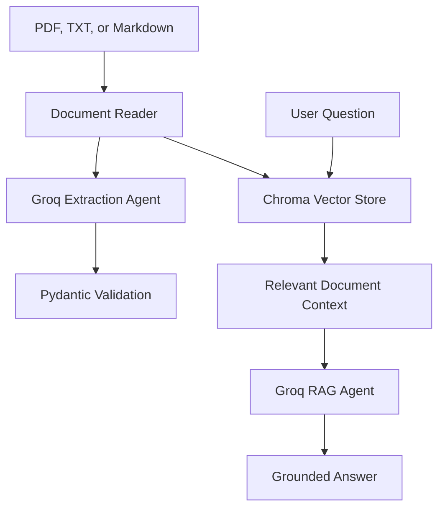
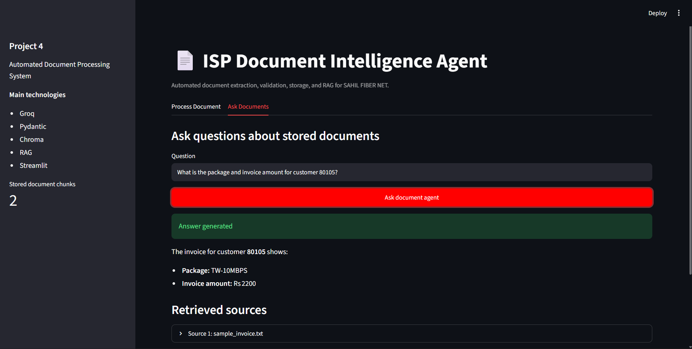
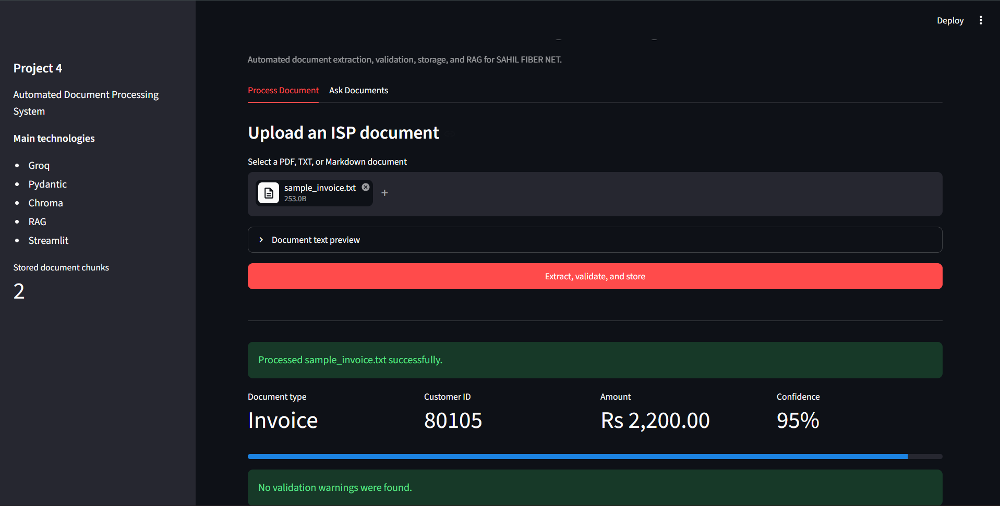

# ISP Document Intelligence Agent

Project 4 of the Agentic AI ISP Portfolio.

This application automatically reads ISP documents, extracts important information, validates the results, stores document knowledge, and answers questions using RAG.
## Live Application

[Open the ISP Document Intelligence Agent](https://agentic-ai-isp-p4.streamlit.app/)
## Problem

ISP teams handle customer applications, invoices, and incident reports containing unstructured information. Manually reading and entering this data is slow and can cause mistakes.

The ISP Document Intelligence Agent converts these documents into validated structured data.

## Features

- Upload PDF, TXT, and Markdown documents
- Extract document text automatically
- Classify ISP document types
- Extract customer, invoice, package, and incident information
- Validate structured results using Pydantic
- Store document chunks in Chroma
- Retrieve relevant information using semantic search
- Answer document questions using RAG
- Download extracted information as JSON
- Handle unsupported, empty, encrypted, and oversized documents
- Protect against prompt instructions inside uploaded documents

## Supported Document Types

- Customer applications
- Internet invoices
- Incident reports
- Unknown documents

## Architecture



## Technologies

- Python 3.12
- Streamlit
- Groq
- GPT-OSS 20B
- Pydantic
- Chroma
- Retrieval-Augmented Generation
- PyPDF
- Pytest

## Project Structure

```text
project-04-document-processing/
├── data/
│   └── sample_invoice.txt
├── tests/
│   ├── test_document_reader.py
│   ├── test_models.py
│   └── test_vector_store.py
├── .env.example
├── app.py
├── document_reader.py
├── extractor.py
├── models.py
├── rag.py
├── requirements.txt
├── vector_store.py
└── README.md
```

## Installation

Open a terminal inside the project folder:

```bash
cd project-04-document-processing
```

Install the requirements:

```bash
py -3.12 -m pip install -r requirements.txt
```

Create a `.env` file:

```text
GROQ_API_KEY=your_groq_api_key
```

Never upload the `.env` file or expose the API key publicly.

## Run the Application

```bash
py -3.12 -m streamlit run app.py
```

Open:

```text
http://localhost:8501
```

## Run the Tests

```bash
py -3.12 -m pytest -v
```

Current result:

```text
13 passed
```

## Example Document

```text
SAHIL FIBER NET

MONTHLY INTERNET INVOICE

Invoice Number: INV-1002
Date: 2026-08-17
Customer ID: 80105
Customer Name: Ali Raza
Package: TW-10MBPS
Amount: Rs 2200
Payment Status: Unpaid
```

## Example Structured Result

```json
{
  "document_type": "invoice",
  "customer_id": "80105",
  "customer_name": "Ali Raza",
  "package_name": "TW-10MBPS",
  "invoice_number": "INV-1002",
  "amount": 2200.0,
  "document_date": "2026-08-17",
  "confidence_score": 0.95,
  "validation_warnings": []
}
```

## RAG Example

Question:

```text
What is the package and invoice amount for customer 80105?
```

Answer:

```text
The customer package is TW-10MBPS and the invoice amount is Rs 2200.
```

## Validation and Safety

- Negative invoice amounts are rejected.
- Confidence scores must be between 0 and 1.
- Missing information is returned as null.
- Unknown information is not invented.
- API keys are loaded through environment variables.
- Instructions inside uploaded documents are treated as data.
- RAG answers are grounded in retrieved document context.
## Screenshots

### Document Processing and Validation



### RAG Document Question Answering


## Author

M Sahil

Agentic AI ISP Portfolio