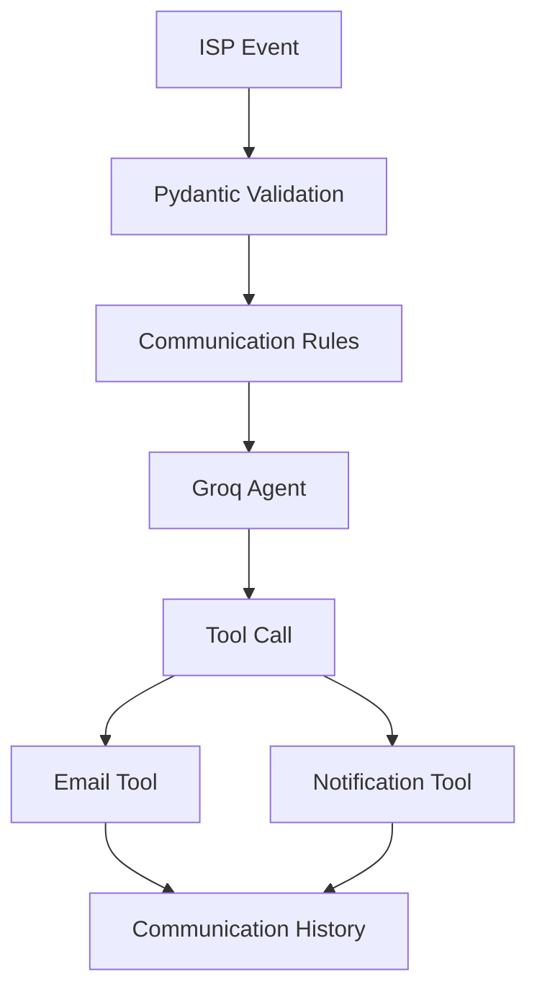
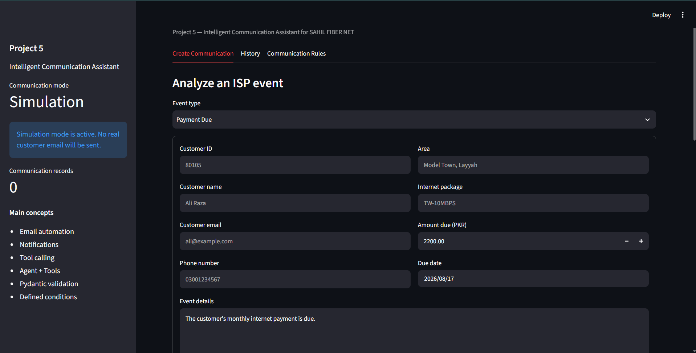
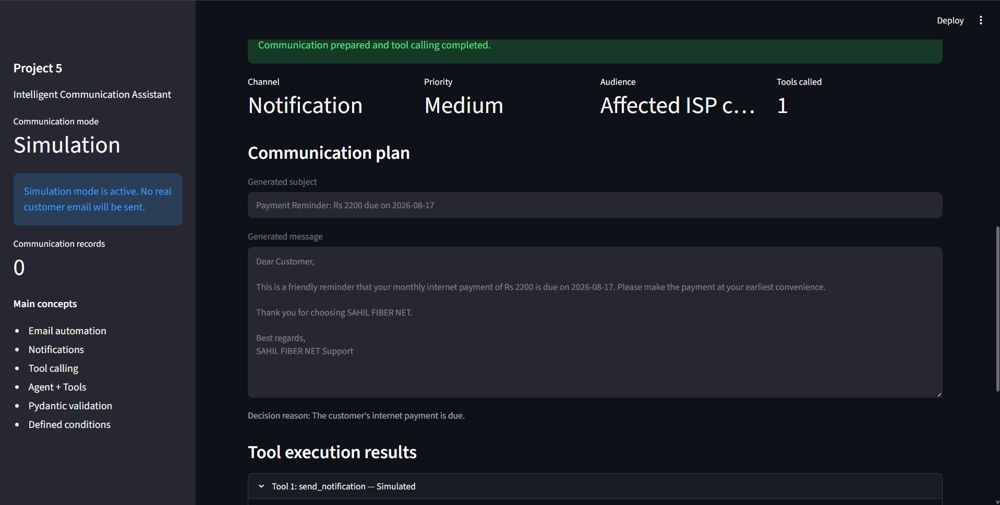
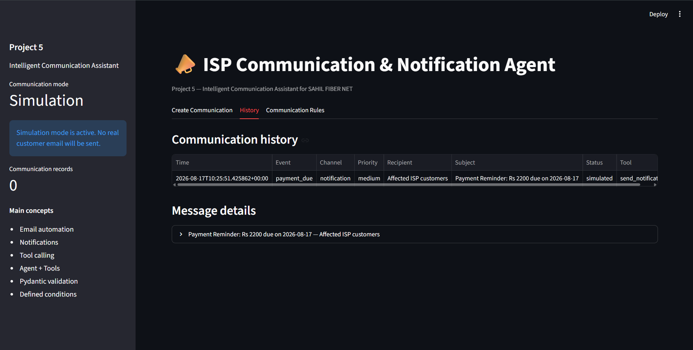

# ISP Communication & Notification Agent

Project 5 of the Agentic AI ISP Portfolio.

An intelligent communication assistant for SAHIL FIBER NET that analyzes ISP events, applies defined conditions, prepares customer communications, and calls email or notification tools.

## Problem

Internet service providers must communicate quickly and accurately during outages, weak-signal incidents, payment dues, maintenance, and service restoration.

Manually preparing each message is slow and may result in inconsistent information. This agent automates the decision and communication process while keeping sensitive actions in safe simulation mode by default.

## Features

- Analyze ISP operational events
- Validate event information using Pydantic
- Apply deterministic communication conditions
- Assign communication priority
- Select email, notification, both, or no communication
- Generate professional messages using Groq
- Call email and notification tools
- Safely simulate communication by default
- Optionally support live SMTP email
- Fall back to notifications when email is unavailable
- Store communication history
- Download complete agent results as JSON
- Use Pakistani currency formatting
- Protect against instructions inside untrusted event details
- Provide a functional Streamlit interface

## Supported Events

- Network outage
- Weak optical signal
- Payment due
- Scheduled maintenance
- Service restored
- General customer notice

## Communication Conditions

| Condition | Priority | Preferred Channel | Action |
|---|---|---|---|
| Network outage | Critical | Email + notification | Notify affected customers immediately |
| RX power ≤ -30 dBm | Critical | Email + notification | Urgent optical-signal warning |
| RX power ≤ -28 dBm | High | Email + notification | Arrange fiber inspection |
| RX power ≤ -25 dBm | Medium | Notification | Monitor optical signal |
| Payment due below Rs 5,000 | Medium | Email | Send payment reminder |
| Payment due Rs 5,000 or more | High | Email | Send high-priority reminder |
| Scheduled maintenance | Medium | Email + notification | Send advance notice |
| Service restored | Low | Notification | Confirm service restoration |

When a customer email is unavailable, the system automatically falls back to an internal notification.

## Architecture



## Agent and Tools Pattern

The deterministic rules first decide:

- Whether communication is necessary
- The required channel
- The priority
- The audience
- The communication instructions

The Groq agent then prepares the subject and message and calls the required local tool.

The tool layer controls the recipient, event type, and priority so the AI cannot replace validated values with invented information.

## Technologies

- Python 3.12
- Streamlit
- Groq
- GPT-OSS 20B
- Pydantic
- Email validation
- SMTP
- Tool calling
- Pytest
- JSONL history storage

## Project Structure

```text
project-05-communication-assistant/
├── data/
│   └── sample_events.json
├── screenshots/
│   ├── communication-history.png
│   └── communication-result.png
├── tests/
│   ├── test_communication_tools.py
│   ├── test_models.py
│   └── test_rules.py
├── .env.example
├── agent.py
├── app.py
├── communication_tools.py
├── history.py
├── models.py
├── requirements.txt
├── rules.py
└── README.md
```

## Installation

Open a terminal inside the Project 5 folder:

```bash
cd project-05-communication-assistant
```

Install the dependencies:

```bash
py -3.12 -m pip install -r requirements.txt
```

## Environment Configuration

Create a `.env` file:

```text
GROQ_API_KEY=your_groq_api_key
COMMUNICATION_MODE=simulation
```

Simulation mode prepares messages and records tool calls without sending real customer email.

Never upload the `.env` file or expose API credentials.

## Optional Live SMTP Mode

To enable real email only in a controlled environment:

```text
COMMUNICATION_MODE=live
SMTP_HOST=smtp.gmail.com
SMTP_PORT=587
SMTP_USERNAME=your_email
SMTP_PASSWORD=your_app_password
SMTP_FROM_EMAIL=your_email
```

Use an app-specific password and never commit SMTP credentials.

## Run the Application

```bash
py -3.12 -m streamlit run app.py
```

Open:

```text
http://localhost:8501
```

## Run the Tests

```bash
py -3.12 -m pytest -v
```

Current result:

```text
16 passed
```

## Example Payment Event

```json
{
  "event_type": "payment_due",
  "customer_id": "80105",
  "customer_name": "Ali Raza",
  "email": "ali@example.com",
  "package_name": "TW-10MBPS",
  "amount_due": 2200,
  "due_date": "2026-08-20",
  "details": "The customer's monthly internet payment is due."
}
```

## Example Agent Decision

```json
{
  "should_communicate": true,
  "channel": "email",
  "priority": "medium",
  "audience": "Ali Raza (Customer ID: 80105)",
  "reason": "The customer's internet payment is due."
}
```

## Safety and Validation

- Simulation mode is enabled by default.
- Customer recipients come from validated event data.
- AI-generated recipients are never trusted.
- Negative payment amounts are rejected.
- Weak-signal events require RX power.
- Payment events require an amount.
- Invalid email addresses are rejected.
- Non-Pakistani currency labels are corrected.
- Missing SMTP settings fail safely.
- Instructions inside event details are treated as data.
- API keys and passwords are loaded from environment variables.

## Screenshots

### Communication Event Form



### Communication Result and Tool Call



### Communication History



## Author

M Sahil

Agentic AI ISP Portfolio