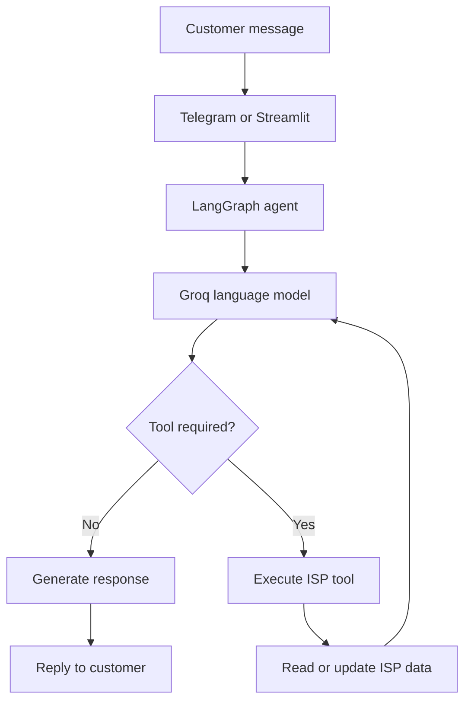
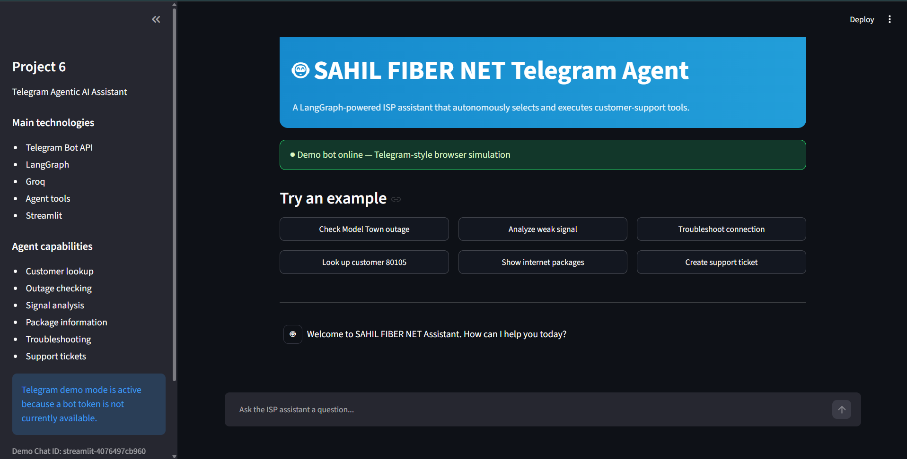
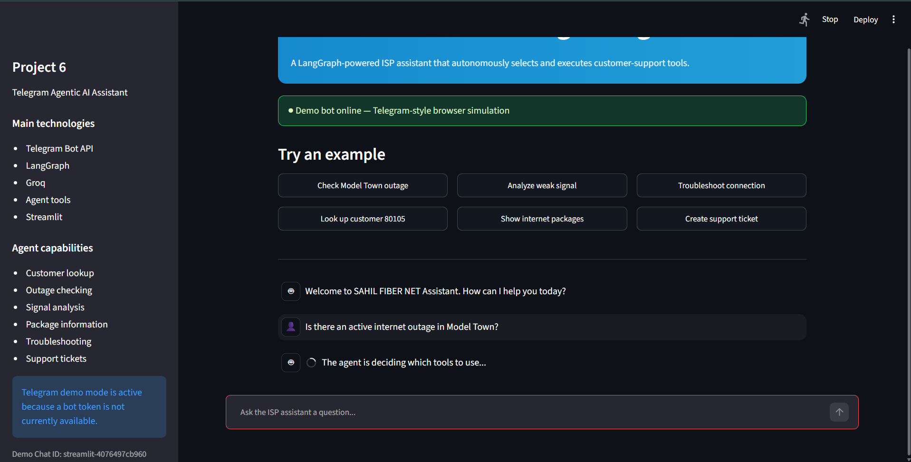
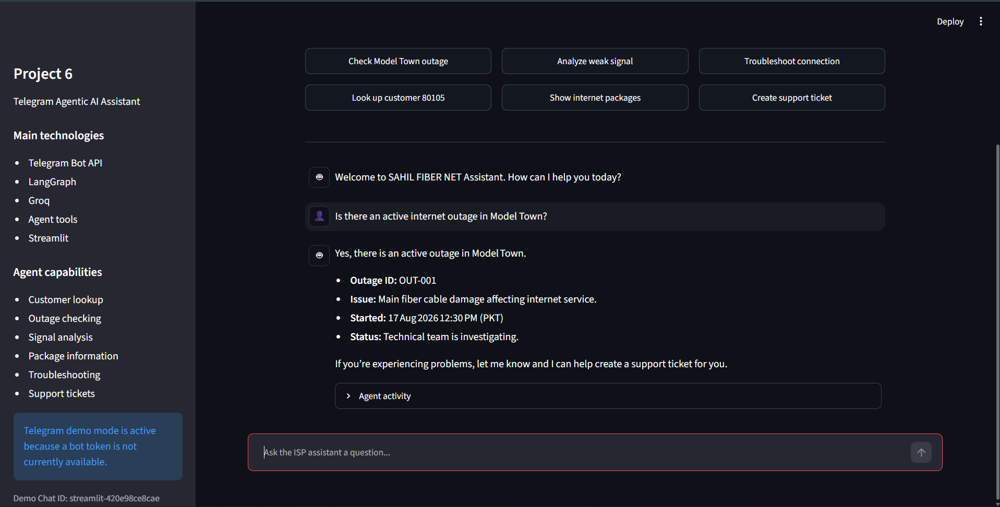

# Project 6 — Telegram Agentic AI Assistant

A production-style Telegram and Streamlit assistant for **SAHIL FIBER NET**. The assistant uses LangGraph, Groq, and ISP tools to understand customer requests, autonomously select the appropriate action, execute tools, and return a helpful response.

This is Project 6 of the Agentic AI ISP Portfolio.

## Overview

The assistant can help ISP customers with:

- Customer account lookup
- Internet outage checking
- Optical RX signal analysis
- Internet package information
- Connection troubleshooting
- Support ticket creation
- Multi-turn conversation memory

The project includes three operating modes:

- **Demo mode:** Browser-based Telegram simulation using Streamlit
- **Polling mode:** Local Telegram bot operation
- **Webhook mode:** Production Telegram deployment

If a Telegram bot token is unavailable, the complete agent workflow can still be demonstrated through Streamlit.

## Agent Workflow



The language model does not directly invent customer or network information. It selects tools that retrieve information from the local ISP data layer.

## Main Technologies

- Python 3.12
- Telegram Bot API
- python-telegram-bot
- LangGraph
- LangChain Core
- LangChain Groq
- Groq
- Pydantic
- Streamlit
- Pytest

## Available Agent Tools

| Tool | Purpose |
|---|---|
| `lookup_customer` | Finds a customer using their customer ID |
| `check_outage` | Checks active outages by service area |
| `analyze_signal` | Evaluates an optical RX power reading |
| `list_internet_packages` | Lists internet packages by provider |
| `troubleshoot_connection` | Provides safe troubleshooting guidance |
| `create_support_ticket` | Creates and stores a customer support ticket |

## Demonstration Screenshots

### Telegram-Style Interface



### Outage Response



### Autonomous Tool Activity



## Example Requests

You can ask the assistant questions such as:

```text
Is there an active internet outage in Model Town?
```

```text
Show account information for customer 80105.
```

```text
Analyze an RX power reading of -30.2 dBm.
```

```text
What internet packages are currently available?
```

```text
My internet is not working and the ONU LOS light is red.
```

```text
Create a high-priority support ticket for customer 80105 because the internet is not working.
```

## Telegram Commands

When a Telegram token is available, the bot supports:

```text
/start
/help
/outage Model Town
/customer 80105
/signal -30.2
/packages
/packages TW
/ticket 80105 Internet is not working
```

Normal conversational messages are also supported.

## Project Structure

```text
project-06-telegram-agent/
│
├── app.py
├── bot.py
├── graph.py
├── isp_tools.py
├── data_store.py
├── models.py
├── prompts.py
├── requirements.txt
├── .env.example
├── README.md
│
├── data/
│   ├── customers.json
│   ├── outages.json
│   ├── packages.json
│   └── tickets.json
│
├── screenshots/
│   ├── telegram-home.png
│   ├── outage-response.png
│   └── agent-tools.png
│
└── tests/
    ├── test_data_store.py
    ├── test_isp_tools.py
    └── test_models.py
```

## Installation

Open Command Prompt in the project directory:

```cmd
cd D:\Agentic_AI\agentic-ai-isp-portfolio\project-06-telegram-agent
```

Install the required packages:

```cmd
py -3.12 -m pip install -r requirements.txt
```

## Environment Configuration

Create a `.env` file using `.env.example` as a guide:

```env
GROQ_API_KEY=replace_with_your_groq_api_key
TELEGRAM_BOT_TOKEN=

BOT_MODE=demo

WEBHOOK_URL=
PORT=8000
TELEGRAM_WEBHOOK_PATH=telegram
TELEGRAM_WEBHOOK_SECRET=
```

Never commit your real `.env` file or API keys to GitHub.

## Run the Streamlit Demo

Set:

```env
BOT_MODE=demo
```

Then run:

```cmd
py -3.12 -m streamlit run app.py
```

The application provides a Telegram-style interface and executes the same LangGraph agent and tools used by the Telegram bot.

## Run the Telegram Bot Locally

When a Telegram bot token becomes available, update `.env`:

```env
TELEGRAM_BOT_TOKEN=replace_with_your_bot_token
BOT_MODE=polling
```

Then run:

```cmd
py -3.12 bot.py
```

The bot will start using Telegram polling.

## Run in Webhook Mode

For production deployment, configure:

```env
TELEGRAM_BOT_TOKEN=replace_with_your_bot_token
BOT_MODE=webhook
WEBHOOK_URL=https://your-public-domain.example
PORT=8000
TELEGRAM_WEBHOOK_PATH=telegram
TELEGRAM_WEBHOOK_SECRET=replace_with_a_random_secret
```

Then run:

```cmd
py -3.12 bot.py
```

The webhook secret must contain only letters, numbers, underscores, and hyphens.

## Run Tests

Run the complete test suite:

```cmd
py -3.12 -m pytest -q
```

Expected result:

```text
22 passed
```

The tests validate:

- Pydantic models and enum values
- Customer ID normalization
- JSON data loading
- Customer and outage lookup
- Package data
- Tool registration
- Customer lookup tool
- Outage checking tool
- Signal analysis tool
- Troubleshooting tool
- Safe support-ticket creation

## Reliability

The Groq client is configured with:

- A 60-second timeout
- Automatic retries for temporary connection failures
- Automatic retries for timeouts
- Automatic retries for rate limits
- Automatic retries for temporary server failures

Retries happen at the model request level, preventing previously completed ISP tools from being repeated.

## Safety and Privacy

The assistant follows these rules:

- It does not expose API keys or environment variables.
- Customer phone numbers are not returned by the lookup tool.
- It does not invent customer, outage, package, or ticket data.
- Support tickets are created only when clearly requested.
- Fiber troubleshooting includes appropriate safety guidance.
- Unknown customers and areas return clear failure responses.
- Runtime ticket data is kept outside Git version control.

## Sample Data

The project uses fictional demonstration data for SAHIL FIBER NET, including:

- Four sample ISP customers
- TW, Z, and MT internet packages
- Active and resolved outage records
- Demonstration support tickets

The data is included only for educational and portfolio purposes.

## Portfolio Repository

This project is part of:

[Agentic AI ISP Portfolio](https://github.com/mohsahil0010-dev/agentic-ai-isp-portfolio)

## Author

**M Sahil**

ISP owner and MikroTik/EPON network operator building practical Agentic AI solutions for telecommunications and customer support.