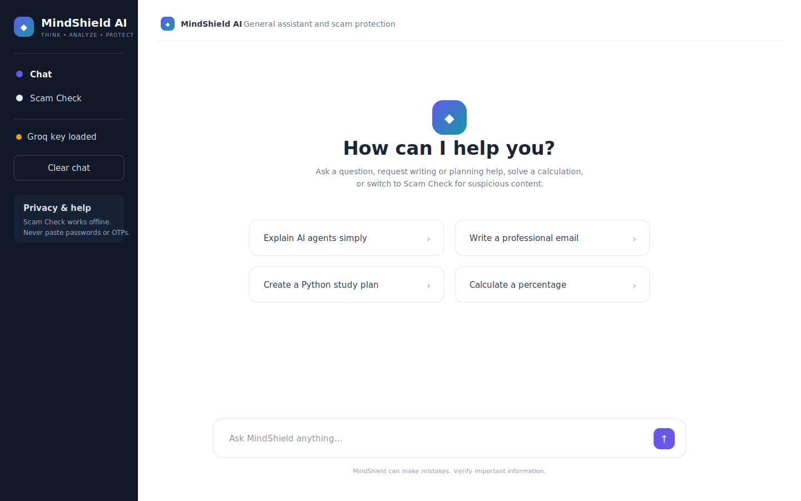
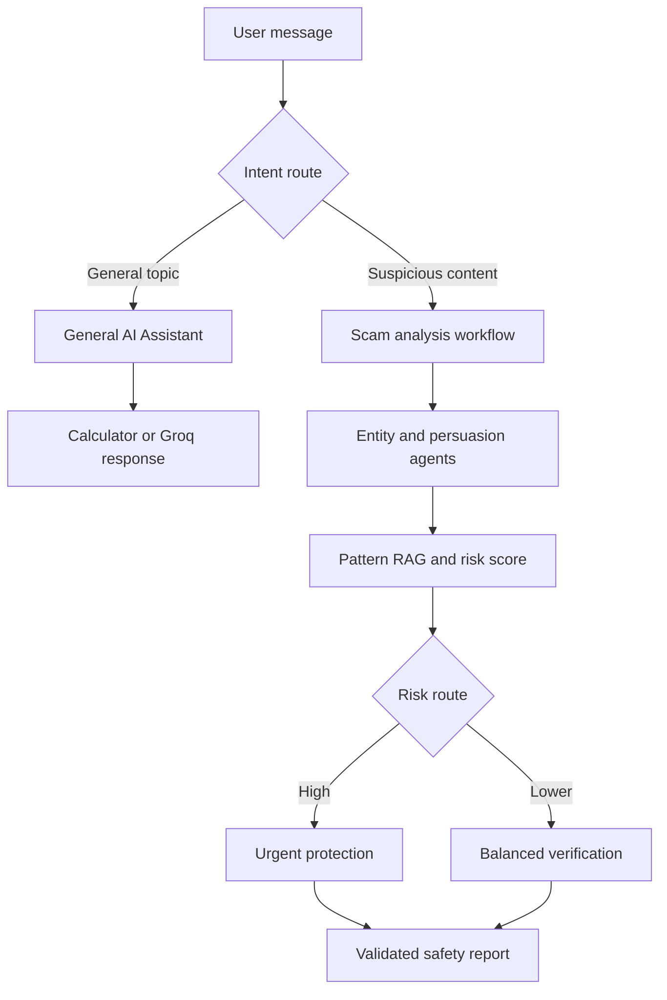

# MindShield AI

**Independent Project 7 - General AI Assistant and Multi-Agent Scam Detection System**

MindShield AI combines a general-purpose conversational assistant with an explainable specialist scam-risk workflow. Users can ask about almost any subject, request writing or planning help, solve calculations, or paste a suspicious WhatsApp message, SMS, email, job offer, marketplace request, or website link for evidence-based analysis.

The general chatbot uses Groq. The complete scam-analysis workflow is deterministic and remains usable without an API key. The interface is intentionally simple: **Chat** for normal questions and **Scam Check** for suspicious content.



## Live application

[Open the deployed MindShield AI application](https://mindshield-ai-p7.streamlit.app/)

`https://YOUR-APP-NAME.streamlit.app`

## Why this project exists

People use AI for everyday questions but often need more than a generic answer when a message asks for money, credentials, remote access, or urgent action. A normal chatbot can give inconsistent safety advice and may not show evidence.

MindShield solves both needs in one interface:

- **General AI Chat** handles education, technology, business, writing, coding, explanations, planning, and ordinary conversation.
- **Scam Analyzer** uses specialist agents, transparent rules, local RAG, conditional routing, structured outputs, and protective actions.

This is a new cybersecurity and general-assistance domain. It is not based on an ISP, billing system, website builder, or Projects 1-6.

## What users can ask

General chat examples:

> Explain how AI agents work in simple words.

> Create a one-week Python study plan for a beginner.

> Write a professional email requesting an internship interview.

> Calculate (12500 × 0.10) + 12500.

Specialist analysis example:

> Is this a scam? “Congratulations! You won Rs. 500,000. Pay a processing fee through Easypaisa and send your OTP immediately. Claim now at http://bit.ly/free-prize.”

## Capabilities

### General AI Chat

- Multi-turn conversation across broad subjects
- Explanations, drafting, summarization, planning, brainstorming, and coding help
- Groq-powered language model with bounded conversation history
- Deterministic safe calculator for suitable arithmetic
- Automatic routing of explicit scam-check requests to the specialist workflow
- Clear provider-error and missing-key behavior

### Specialist Scam Analyzer

- Auto-detects the likely source type
- Extracts URLs, emails, phones, amounts, payment services, and credential requests
- Inspects URL structure without opening links
- Detects urgency, threats, secrecy, advance fees, prizes, account secrets, fake jobs, remote access, and unusual payments
- Retrieves similar patterns from an original local scam-pattern dataset
- Retrieves relevant safety guidance from a private local knowledge base
- Produces a transparent 0-100 risk score with a score breakdown
- Selects an urgent-protection or balanced-verification branch
- Accounts for links opened, money sent, and sensitive information shared
- Produces safe actions, a suggested reply, reporting guidance, limitations, and agent trace
- Exports Markdown and JSON evidence reports

## Architecture



The Scam Analyzer uses a LangGraph shared state. After evidence scoring, a conditional edge selects the response strategy. Pydantic validates the input, every structured component, and the final report.

## Specialist agents

| Agent | Responsibility | Evidence / tools |
|---|---|---|
| Intake & Intent Agent | Validates the case and determines its source | Pydantic and source classifier |
| Entity & Link Inspector | Extracts security-relevant entities and inspects link structure | Regex extraction, URL parser, structural checks |
| Social Engineering Analyst | Detects persuasion and credential tactics | Weighted transparent rule library |
| Scam Pattern Retrieval Agent | Retrieves similar scams and safety knowledge | Original JSON pattern data and local RAG |
| Evidence & Risk Scoring Agent | Creates a bounded risk score and confidence | Indicator, URL, pattern, and exposure breakdown |
| Conditional Response Agent | Selects urgent or balanced action | LangGraph conditional edge |
| Lead Safety Coordinator | Builds a validated final report | Actions, safe reply, limitations, exports, optional Groq summary |

## Course concepts demonstrated

| Concept | Implementation |
|---|---|
| LangGraph | Stateful workflow with conditional routing |
| Multi-agent system | Seven specialist roles in the executed branch |
| Tool calling | Entity extraction, URL inspection, detection, retrieval, scoring, calculator, exports |
| Agentic RAG | Pattern and safety-knowledge retrieval based on case evidence |
| Structured output | Pydantic models for case, entities, links, indicators, matches, risk, actions, trace, report |
| LLM integration | Groq general chat and optional scam-summary enhancement |
| Guardrails | Secret warnings, input bounds, safe calculator, no link opening, score bounds, critical-action validation |
| Error handling | Offline scam fallback, provider timeout, provider failure response, validation errors |
| Observability | Visible score breakdown, route, evidence, and agent trace |
| Streamlit UI | Chat interface, specialist workspace, guide, reports, downloads |
| Testing | Models, tools, both workflow branches, exposure actions, chat routes, exports, UI |

## Project structure

```text
project-07-mindshield-ai/
├── app.py
├── scamshield/
│   ├── __init__.py
│   ├── agents.py
│   ├── exporter.py
│   ├── llm.py
│   ├── models.py
│   ├── tools.py
│   └── workflow.py
├── data/
│   ├── safety_knowledge.md
│   └── scam_patterns.json
├── tests/
│   ├── conftest.py
│   ├── test_models.py
│   ├── test_tools.py
│   └── test_workflow.py
├── screenshots/
├── .env.example
├── .gitignore
├── DEMO_SCRIPT.md
├── PROJECT_REPORT.md
├── requirements.txt
└── requirements-dev.txt
```

## Run on Windows

```bat
cd project-07-mindshield-ai
py -3.12 -m venv .venv
.venv\Scripts\activate
python -m pip install --upgrade pip
pip install -r requirements-dev.txt
set GROQ_API_KEY=your-own-key
streamlit run app.py
```

PowerShell uses:

```powershell
$env:GROQ_API_KEY="your-own-key"
streamlit run app.py
```

The browser should open at `http://localhost:8501`.

Without a Groq key, Scam Analyzer and calculator demonstrations still work. General open-topic responses require the key.

MindShield loads `.env` automatically when the app starts. It uses Groq's `openai/gpt-oss-20b` production model by default and automatically retries with `openai/gpt-oss-120b` if the configured model is unavailable. Authentication, rate-limit, connection, and model errors are shown as specific instructions instead of a generic failure message.

## Tests

```bash
pytest -q
```

The suite covers validation, entity extraction, URL inspection, scam indicators, pattern retrieval, risk scoring, safe calculation, missing-key behavior, urgent routing, balanced routing, exposure actions, and report exports.

## Deploy on Streamlit Community Cloud

1. Put this folder in the GitHub repository used for the course.
2. Push it without `.env` or any secret file.
3. Open [Streamlit Community Cloud](https://share.streamlit.io/) and select **Create app**.
4. Choose the repository and branch.
5. Set the entrypoint to `project-07-mindshield-ai/app.py`.
6. Select Python 3.12 in Advanced settings.
7. Add this in the Streamlit Secrets box:

```toml
GROQ_API_KEY="your-own-key"
MINDSHIELD_MODEL="openai/gpt-oss-20b"
```

8. Deploy and test both workspaces.
9. Add the public application URL near the top of this README.

## Safety and privacy boundaries

- Do not paste passwords, OTPs, PINs, CVVs, seed phrases, full card numbers, or unnecessary identity numbers.
- The app does not store a database of submitted messages.
- Suspicious links are parsed as text and never opened by the analyzer.
- A low score is explicitly not presented as proof of legitimacy.
- The system does not accuse a named individual of committing a crime.
- Current facts and high-stakes decisions require independent official verification.
- The assistant does not claim to browse the web unless a future verified browsing tool is connected.
- API keys are read only from environment variables or Streamlit Secrets.

## Originality statement

The MindShield domain combination, conditional workflow, synthetic scam-pattern dataset, local safety knowledge base, scoring design, detection rules, calculator, interface, tests, and documentation were created specifically for this independent Project 7. No complete GitHub project or tutorial implementation was copied. The author should review each module and be ready to explain it during assessment.

## Author

M Sahil - Agentic AI Short Course, University of Layyah
